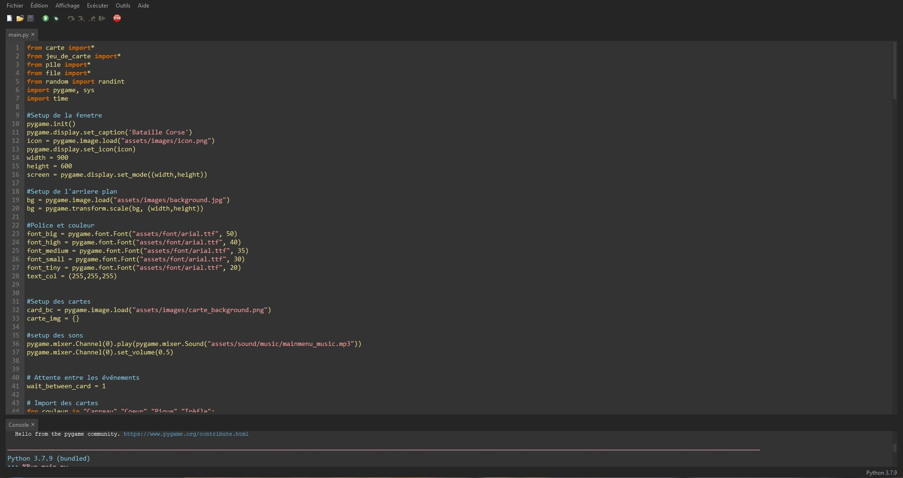

# Bataille Corse en Python, utilisant Pygame.

Tout d'abord, télécharger le source code en .zip et décomprésser le sur votre bureau sous forme de dossier.

Pour lancer le programme, vous devez avoir en premier lieu le logiciel <a href="https://thonny.org/">Thonny</a> et <a href ="https://www.python.org/downloads/">Python</a>. Ensuite, lancer le fichier `main.py` 
avec Thonny.

## Les libraries à installer

Une fois `main.py` ouvert avec Thony, vous devriez être ici 

Cliquez sur `Outils` (Tools) et ensuite `Gérer les plugins` (Manage plugins). Ensuite taper "pygame" et prenez le resultat de recherche __pygame - Python Game Development__.

Faîte la même chose pour `random` et `time`.

## Lancer le jeu

Une fois toute les libraries installées, vous êtes prêt à lancer le jeu ! Pour ce faire, vous avez juste à appuyer sur la touche `F5` de votre clavier ou appuyer sur le bouton play en haut à gauche.

## Sources

Les sources des bandes sons utiliseés.

https://youtu.be/T_9NnAEaDxA

https://youtu.be/6Yafe0qGJ2U

Proviennent du jeu Nintendo DS 42 jeux indémodables.
